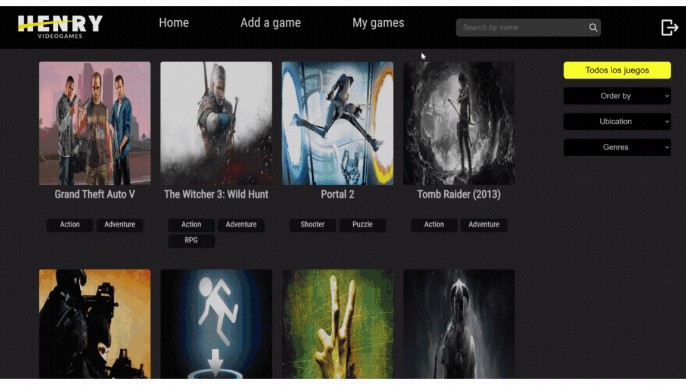
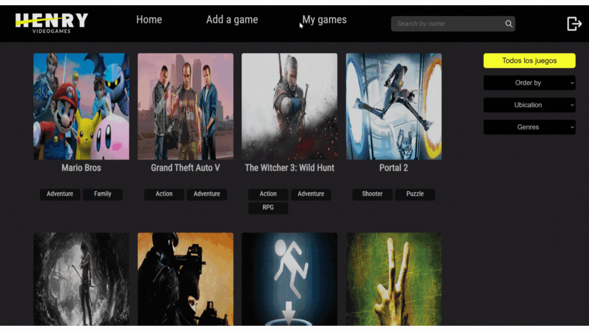
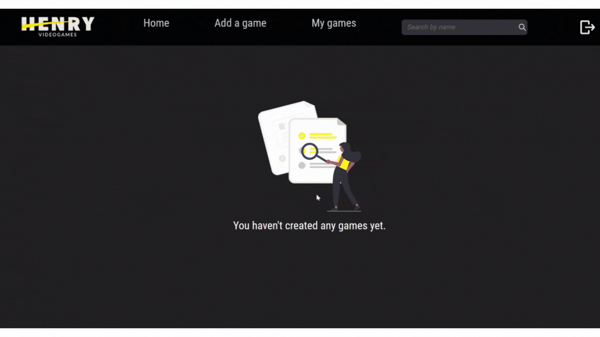

# Rick And Morty App

## 📌 About this proyect

This project is a single page application built with:
- __Front End__: React, Redux, Html, Css
- __Back End__: Node Js, Express, Sequelize
- __Database__: PostgreSQL

### 📌 How to start this page ?

This project needs a `.env` file inside the Server folder.

File structure:
- `URL_BASE='https://api.rawg.io/api'`
- `KEY`
- `DB_USER`
- `DB_PASSWORD`
- `PORT`
- `DB_HOST`

#### ❓ Where do I find this data?
- You have to create a database on your computer with a username and password. This values are `DB_USER` and `DB_PASSWORD`.
- `PORT` will be the port where your server will be running.
- `DB_HOST` will be the host where your Database will be running.
- You can get an `API_KEY` at https://rawg.io/apidocs by clicking on "Get API key"

📍 Then, you can run:

- In Server folder:
  - `npm install` 
  - `npm start` 

- In Client folder:
  - `npm install` 
  - `npm start` 

<!-- Open [http://localhost:3000](http://localhost:3000) to view it in your browser. -->

## 📌 Sections of this project

### ⚡️Landing:
- in the landing is the entrance to the page.

 
    </img>

### ⚡️Home:
- You can:
   - Search games by name. 
   - By clicking on the game, you can see the description of the games.
   - Filter games by ubication (API or database)
   - Order games by Ascencentent, descendent or by Rating
   - See different game pages

 
    </img>

### ⚡️Create Game:
In this section you can add/create a new game

 
    </img>

### ⚡️MyGames:
- In this section you can see all the games created by you
- From here you can update a game or delete it

 
    </img>

### ⚡️Exit:
- When clicking exit, they are redirected to the landing page

 
    </img>

